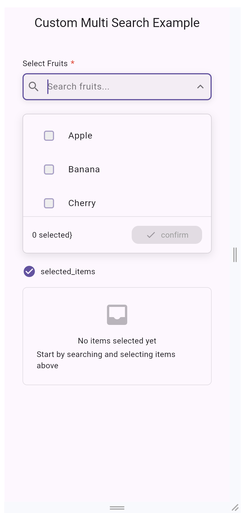
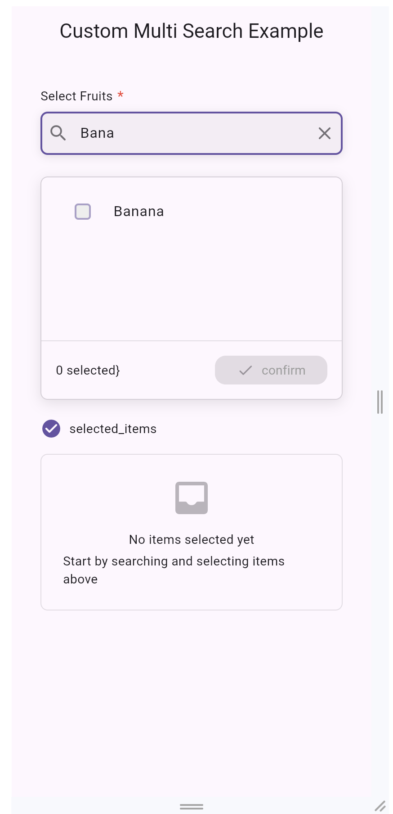
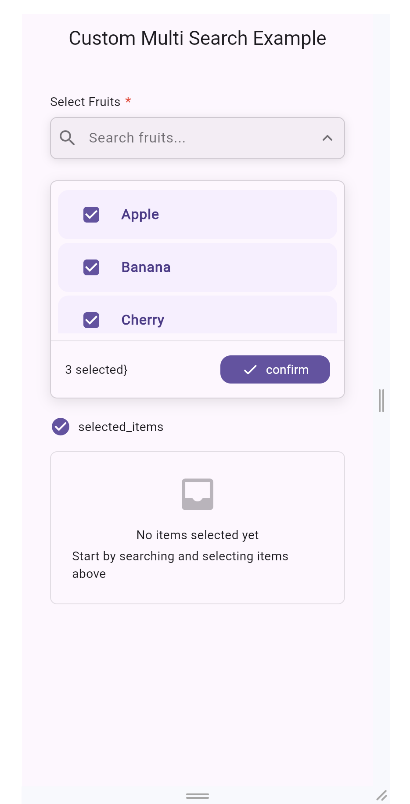
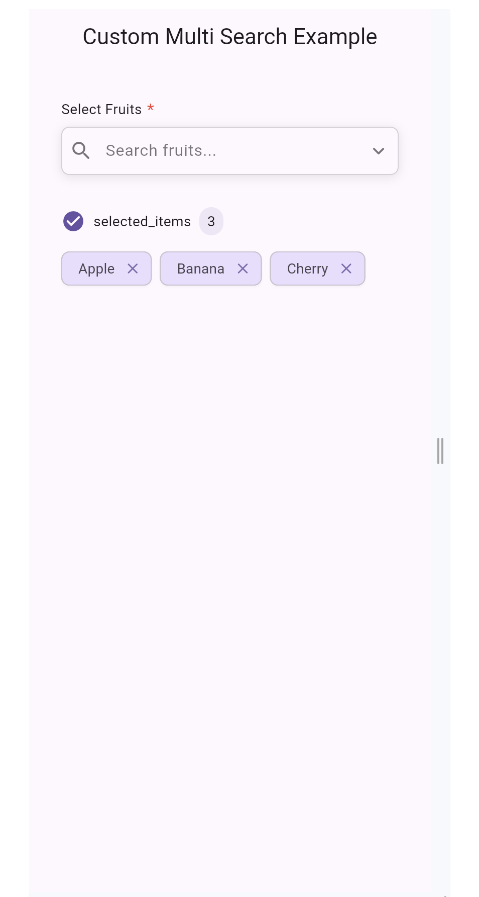

# Custom Multi Search

[](https://pub.dev/packages/custom_multi_search)
[](https://pub.dev/packages/custom_multi_search/score)
[](https://pub.dev/packages/custom_multi_search/score)
[](LICENSE)

A **customizable multi-select dropdown widget with search functionality** for Flutter applications.  
Built with **MobX** for reactive state management, smooth animations, and form validation support.

---

## 📖 Table of Contents
- [Custom Multi Search](#custom-multi-search)
  - [📖 Table of Contents](#-table-of-contents)
  - [✨ Features](#-features)
  - [📸 Preview](#-preview)
    - [Example](#example)
  - [🚀 Installation](#-installation)
  - [🛠 Usage](#-usage)
  - [⚙️ Parameters](#️-parameters)
  - [🤝 Contributing](#-contributing)
  - [📜 License](#-license)
  - [🙌 Acknowledgments](#-acknowledgments)

---

## ✨ Features

- 🔍 **Searchable multi-select dropdown** – quickly find and select items.
- 🎨 **Customizable display** – render items as text, icons, or custom widgets.
- ⚡ **MobX-powered state management** – ensures reactive and scalable behavior.
- 🪄 **Smooth animations** – professional and responsive UI interactions.
- 📱 **Material Design styling** – seamless Flutter integration.
- ✅ **Form validation support** – integrate directly into forms.

---

## 📸 Preview

### Example

|                                                |                                                   |                                                   |                                                   |
| ---------------------------------------------- | ------------------------------------------------- | ------------------------------------------------- | ------------------------------------------------- |
|  |  |  |  |


---

## 🚀 Installation

Add this to your package’s `pubspec.yaml` file:

```yaml
dependencies:
  custom_multi_search: ^1.0.5
```

Then run:

```sh
flutter pub get
```

---

## 🛠 Usage

```dart
import 'package:custom_multi_search/custom_multi_search.dart';

class ExamplePage extends StatelessWidget {
  @override
  Widget build(BuildContext context) {
    return Scaffold(
      body: Padding(
        padding: const EdgeInsets.all(16),
        child: CustomMultiSearch<String>(
          items: ['Apple', 'Banana', 'Mango', 'Orange'],
          hintText: 'Select fruits',
          onChanged: (selectedItems) {
            print(selectedItems); // List of selected values
          },
          validator: (values) {
            if (values == null || values.isEmpty) {
              return 'Please select at least one item';
            }
            return null;
          },
        ),
      ),
    );
  }
}
```

---

## ⚙️ Parameters

| Property      | Type                           | Description                                        |
| ------------- | ------------------------------ | -------------------------------------------------- |
| `items`       | `List<T>`                      | The list of items to display in the dropdown.      |
| `onChanged`   | `Function(List<T>)`            | Callback when items are selected/deselected.       |
| `hintText`    | `String`                       | Placeholder text shown when no selection is made.  |
| `validator`   | `FormFieldValidator<List<T>>?` | For form validation.                               |
| `chipBuilder` | `Widget Function(T)`           | Customize the display of selected items.           |
| `itemBuilder` | `Widget Function(T)`           | Customize how items are displayed in the dropdown. |

---

## 🤝 Contributing

Contributions are welcome! 🎉  
- Fork the repo  
- Create a feature branch  
- Submit a Pull Request  

Feel free to open an [issue](../../issues) for bugs or feature requests.

---

## 📜 License

This project is licensed under the [MIT License](LICENSE).

---

## 🙌 Acknowledgments

- [Flutter](https://flutter.dev) for the awesome framework.  
- [MobX](https://pub.dev/packages/mobx) for state management inspiration.  